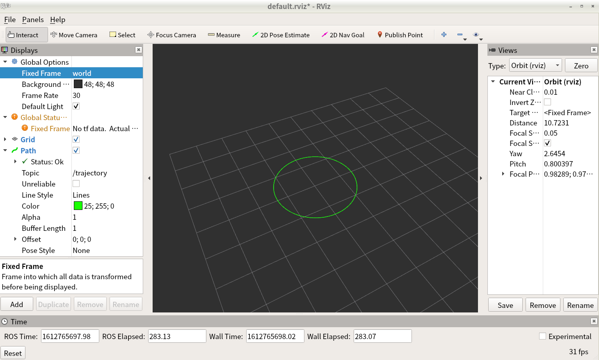

# Jetson Nano配置ROS在rviz上显示自定义轨迹

[toc]
-----

## 新建工程
```bash
# 创建catkin工程环境，如果已有则跳过
# mkdir -p catkin_ws/src

cd src
catkin_create_pkg showpath roscpp sensor_msgs std_msgs nav_msgs tf
cd ..
catkin_make
```

【catkin_make时报错：No module named 'catkin_pkg'】
```
ImportError: “from catkin_pkg.topological_order import topological_order” failed: No module named 'catkin_pkg'
Make sure that you have installed “catkin_pkg”, it is up to date and on the PYTHONPATH.
```
**解决方案**：
1. 打开catkin_make文件
```bash
sudo gedit /opt/ros/kinetic/bin/catkin_make
```
> 由于catkin_make为系统文件readonly，因此不可以通过vim编辑
2.将python脚本解释器改为`#!/usr/bin/python2`即可


## 编译和运行

1. 编写主函数：在`showpath/src/`中创建[showpath.cpp](https://github.com/doubleZ0108/Play-with-NVIDIA-Jetson-Nano/blob/master/ROS/rviz-showpath/showpath.cpp)
2. 编辑`CMakeLists.txt`: 在`showpath/CMakeLists.txt`最后增加两行
```bash
add_executable(showpath src/showpath.cpp)
target_link_libraries(showpath ${catkin_LIBRARIES})
```
3. 编译
```bash
# 回到catkin_ws目录
# cd ~/catkin_ws

rm -rf build
catkin_make -j2
```
4. 运行
```bash
source ./devel/setup.bash

# 打开一个终端运行
roscore

# 打开另一个终端运行
rosrun showpath showpath

# 打开第三个终端测试
rostopic echo /trajector
```

【rosrun时报错：无法连接到ROS master，ERROR: unable to contact ROS master at [http://192.168.0.20:11311]】
问题原因：没有运行`roscore`
解决方案：在新终端运行`roscore`
其他解决办法：导出路径
```bash
$ export ROS_HOSTNAME=localhost
$ export ROS_MASTER_URI=http://localhost:11311
```


【报错：libroscpp.so: cannot open shared object file: No such file or directory】
```
[rosout-1] restarting process
/opt/ros/melodic/lib/rosout/rosout: error while loading shared libraries: libroscpp.so: cannot open shared object file: No such file or directory
process[rosout-1]: started with pid [14028]
[rosout-1] process has died [pid 14028, exit code 127, cmd /opt/ros/melodic/lib/rosout/rosout __name:=rosout __log:=/home/nano/.ros/log/9bbbb974-69d3-11eb-a0bf-48b02d2de5df/rosout-1.log].
log file: /home/nano/.ros/log/9bbbb974-69d3-11eb-a0bf-48b02d2de5df/rosout-1*.log
```
解决方案：
在命令行中直接输入一下指令指定路径
```bash
LD_LIBRARY_PATH=/opt/ros/melodic/lib
```


## rviz实验效果

```bash
rosrun rviz rviz
```
1. 在`Global Options`中把第一项`Fixed Frame`改为`world`
2. 点击侧边栏左下角的`Add`，添加一个`Path`
3. 在`Path`中下拉`Topic`，选择`/trajectory`



<br/>

## Resources
一些原理和nav_msgs/Path.msg结构等可以参考：[ROS在rviz中实时显示轨迹（nav_msgs/Path消息的使用）_qq_43176116的博客-CSDN博客](https://blog.csdn.net/qq_43176116/article/details/88045741)